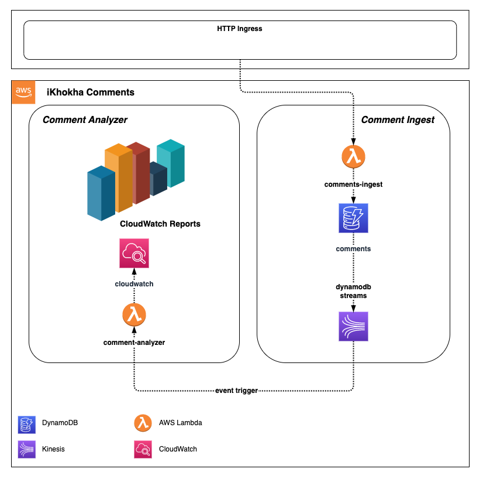

# iKhokha Tech Check

### Customer Review Analyzer
---
### Introduction

At iKhokha, we love receiving feedback from our customers - especially when it's positive :) We would like to analyze our customer online reviews and comments and the new graduate was tasked to write a Java Application that will run through all the comments and create a report with totals to be used for business intelligence and marketing. 

We currently have three metrics that we keep track of:

  - Total number of comments that are shorter than 15 characters
  - Total number of comments that refer to the "Mover" device
  - Total number of comments that refer to the "Shaker" device

The daily comments are stored in text files under the **docs** directory within the project. Each line represents a single comment by a customer. All files in the directory get analyzed and the report gets printed to the console.

#### Prerequisites
  - Git
  - JDK 1.8 or later
  - An IDE of your choice (Eclipse, IntelliJ IDEA etc)

---
### Tasks
Clone this repo and complete the 3 tasks below. Be sure to read each one carefully and make your changes to the existing code provided in the project. Once complete, you can upload it to your own repo and share the url. Alternatively you can zip it up and send via email. Good luck!

##### 1. Debugging and Logical problem solving

Unfortunately our graduate seems to have a couple of bugs in his code. Word is that the report looks like it only shows the last day's comments. Emma from marketing also mentioned that some values are too low, particularly when more than one product (Mover or Shaker) is mentioned in the same comment. Your task is to fix these bugs so that the correct values are displayed in the final report.

##### 2. Object Oriented design

We foresee that over time, a lot of new metrics will be added to our report and our list of *if* statements will become long and clunky. By utilizing your skills in Object Oriented design, rewrite the matcher algorithm to make it more extensible/pluggable for adding new metrics.

Once you've made your change, add the following additional metrics:

  - Some customers use the comments section to ask questions. Add a new metric named **QUESTIONS** that displays a count of comments that contain one on more question marks "?"

  - Marketing noticed that some of the comments are spam. Add a new total called **SPAM** to the report, which should count lines that contain a url to a web page.
 
##### 3. Concurrency

Our social media pages are becoming more popular! We expect our daily comment files to become huge, resulting in long processing times per file. The current code processes the files sequentially. Change the implementation to process them concurrently using separate threads (ie one thread per file) and then consolidate the results to print the report.

Bonus question: Bear in mind that at any given time, there can be thousands of comment files in the docs folder which might crash the app if we spawn threads uncontrollably.

##### 4. Concurrency Response
In the age of cloud computing it is not recommended to be using large resource that consume memory time & processing power. To deal with concurrency an architectured design ***'src/comment-analyzer.drawio.png'*** is proposed to deal the high input & high demand.

The nestjs framework generates a javascript application that can be deployed to aws lambda (serverless library not in project). Javascript is basically a single thread application.

A kenisis trigger is assigned to the ***'comment-analyzer'*** lambda. A kinesis stream will listen to any changes that occur on the ***'comments'*** dynamo db. The lambda's will upscale automatically to deal with high demand. The ***'comment-analyzer'*** Lambda processes one comment & outputs a log to cloudwatch.

All reports can be generated in a data or ui format on cloudwatch. Historical data will be available as well.

Due to the proposed design for the ***'comment-analyzer'*** lambda, this application requires changes to handle events & triggers. 

The current standalone application is to complete the tasks requested in the ***"src/readme.md"***.

